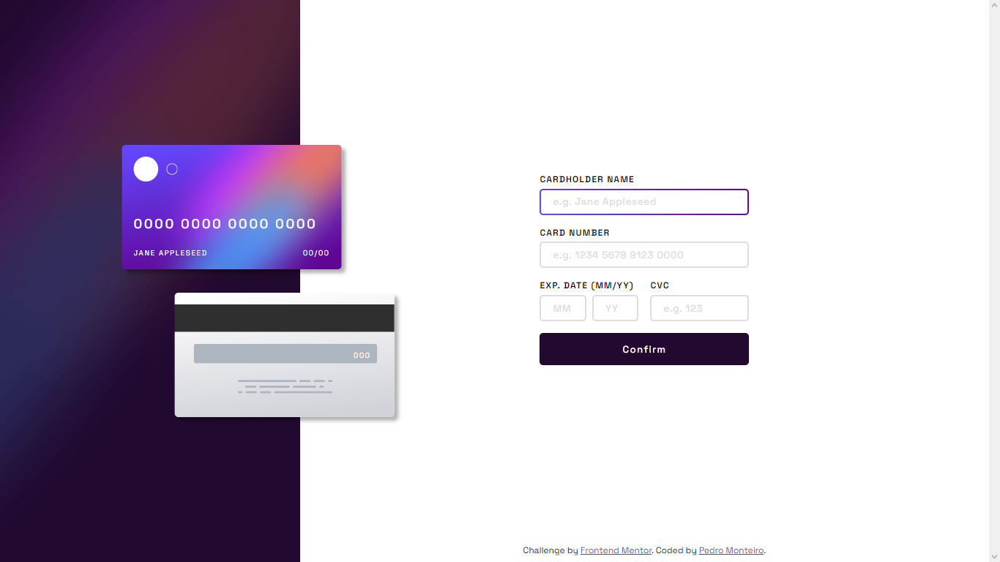

# Frontend Mentor - Interactive card details form solution

This is a solution to the [Interactive card details form challenge on Frontend Mentor](https://www.frontendmentor.io/challenges/interactive-card-details-form-XpS8cKZDWw). Frontend Mentor challenges help you improve your coding skills by building realistic projects. 

## Table of contents

- [Overview](#overview)
  - [The challenge](#the-challenge)
  - [Screenshot](#screenshot)
  - [Links](#links)
- [My process](#my-process)
  - [Built with](#built-with)
  - [What I learned](#what-i-learned)
  - [Continued development](#continued-development)
  - [Useful resources](#useful-resources)
- [Author](#author)

## Overview

### The challenge

Users should be able to:

- Fill in the form and see the card details update in real-time
- Receive error messages when the form is submitted if:
  - Any input field is empty
  - The card number, expiry date, or CVC fields are in the wrong format
- View the optimal layout depending on their device's screen size
- See hover, active, and focus states for interactive elements on the page

### Screenshot

  

  

  

  
  

### Links

- Solution URL: [https://github.com/montteiropedro/card-details-form](https://github.com/montteiropedro/card-details-form)
- Live Site URL: [https://montteiropedro.github.io/card-details-form/](https://montteiropedro.github.io/card-details-form/)

## My process

### Built with

- HTML5
- CSS3
- Javascript
- Mobile-first workflow

### What I learned

In this project I went with HTML, CSS and Javascript, so I can revise my knowleadgement and improve it more.

### Continued development

I think this was the first time that I really took some time to use only HTML, CSS and Javascript for some custom validations. During the project I could notice that I was lacking some knowleadge in this area so I'm really satisfied that a went with HTML, CSS and Javascript in this project. Now the focus is to cotinue learning more and more about validations.

### Useful resources

- [Form Custom Validations](https://www.youtube.com/watch?v=GTMEuHxh8aQ) - This Rocketseat video helped me a lot with the validations customization.

## Author

- Website - [Pedro Monteiro](https://github.com/montteiropedro)
- Frontend Mentor - [@montteiropedro](https://www.frontendmentor.io/profile/montteiropedro)
- Twitter - [@montteiropedro](https://twitter.com/montteiropedro)
